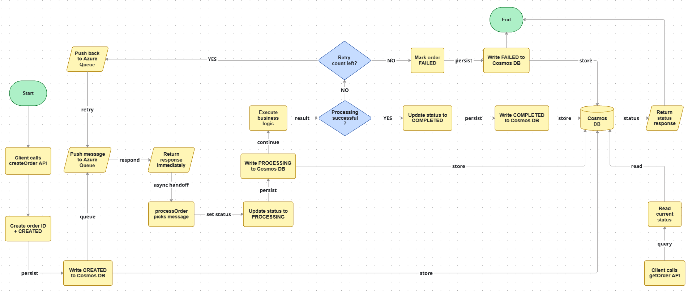

# Event-driven Order Processing System
A serverless, event-driven backend system that processes orders asynchronously using Azure Functions, Queue Storage, and Cosmos DB. The system demonstrates real-world patterns such as decoupling, retry handling, and eventual consistency.

---

## Architecture

```
Client
│
▼
createOrder (HTTP Function)
│
▼
Azure Queue Storage ←─── (decoupling + async boundary)
│
▼
processOrder (Queue Trigger Function)
│
▼
Cosmos DB
```
---

## Flowchart


---

## Tech Stack

- **Azure Functions (Python)** — Serverless compute for API and worker  
- **Azure Queue Storage** — Message queue for asynchronous processing  
- **Azure Cosmos DB (SQL API)** — NoSQL database for order state  
- **Azurite** — Local development for storage emulation  
- **Postman** — API testing  

---

## Workflow

1. Client sends request to `createOrder` API  
2. System generates:
   - `orderId`
   - status = **CREATED**
3. Order is stored in Cosmos DB  
4. Order message is pushed to Azure Queue  
5. API returns response immediately (no blocking)

---

## Asynchronous Processing

- Queue triggers the `processOrder` worker function  
- Worker updates status to **PROCESSING**  
- Executes business logic (simulated processing)

---

## Fault Tolerance & Retry

- Failures are simulated during processing  
- Azure Queue automatically retries failed messages  
- Retry count is tracked using `dequeue_count`  

### Behavior:
- If retries remain → message is reprocessed  
- If retries exhausted → order marked as **FAILED**  

---

## State Transitions
```
CREATED → PROCESSING → COMPLETED/FAILED (after fixed number of retries)
```
---

## Data Persistence

All order states are stored in **Cosmos DB**:

- CREATED (initial state)
- PROCESSING (during execution)
- COMPLETED / FAILED (final state)

---

## API Endpoints

### Create Order: POST /api/createOrder
**Request**
```json
{
  "item": "item_name"
}
```
**Response**
```json
{
  "orderId": "...",
  "status": "CREATED"
}
```
### Get Order Status: GET /api/getOrder/{orderID}
Returns the latest order state from Cosmos DB.

---

## Deployment
Deployed on Azure Functions: https://order-system-func-mk31.azurewebsites.net

---

## Key Concepts Demonstrated

- Event-driven architecture
- Asynchronous processing
- Decoupling via message queues
- Retry mechanisms & failure handling
- Eventual consistency
- Serverless deployment (Azure Functions)

---

## Future Improvements

- Add authentication (Azure AD / API keys)
- Replace Queue with Azure Service Bus for advanced messaging
- Add monitoring via Application Insights
- Optimize latency by co-locating resources
- Implement dead-letter queue handling
